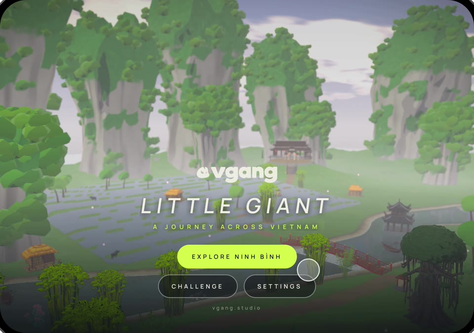
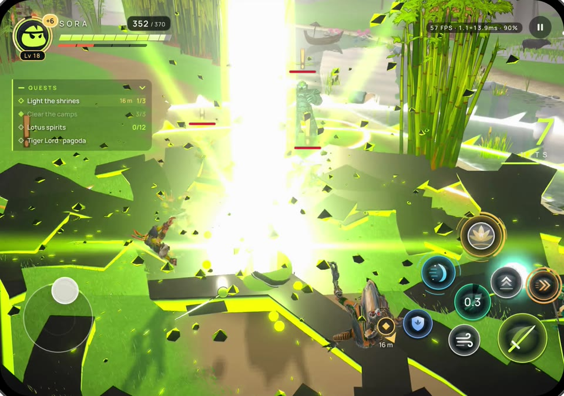
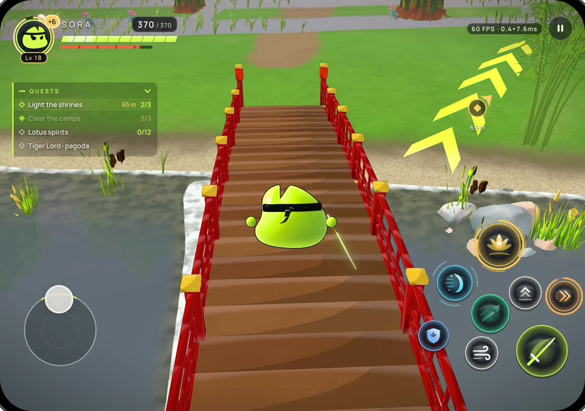
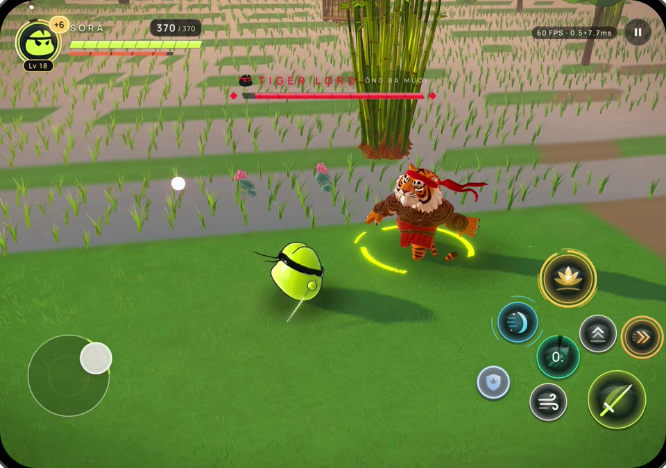
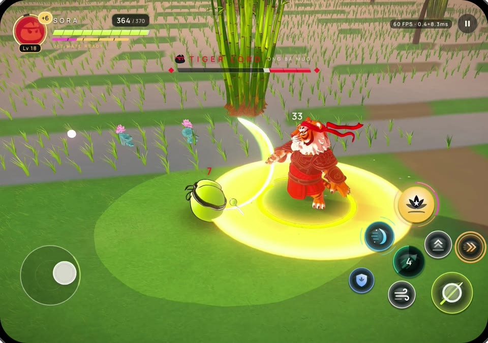
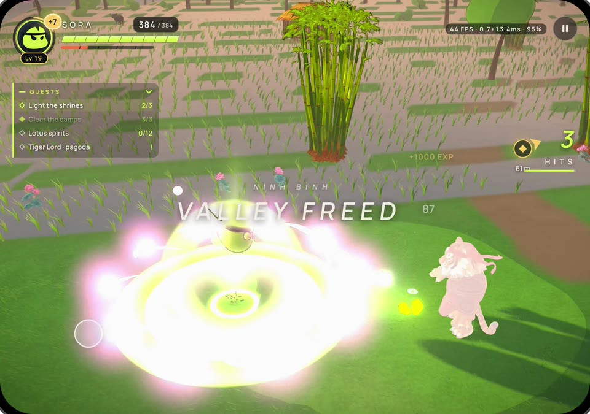

# Little Giant: Ninh Bình — a VGANG action RPG in React Native

The VGANG mascot, SORA, walks out of her village into a 3D valley modelled on
Tràng An, fights the Tiger Lord's goblins down the river towpath, crosses the red
bridge and faces Ông Ba Mươi himself. It is a real-time 3D game with no Unity
and no native code of our own: every line is TypeScript in React Native, drawn
by three.js on WebGPU (`react-native-webgpu`, Dawn), with every shader written
in TypeGPU.

| | | |
|---|---|---|
|  |  |  |
|  |  |  |

- **The valley**: karst towers, rice terraces, a river with a live mirror, the
  red bridge and the thủy đình, a village, shrines and lotus spirits, a
  morning-to-dusk sky, a guide of arrows on the ground.
- **SORA's kit**: a three-blow combo, dash, jump and air cut, the sword
  streak, kiếm khí, guard and parry, sprint, and two ultimates on one
  charge bar: the Heaven Pierce and, charged twice, the lotus tempest (Sen Bão).
- **The Tiger Lord (Ông Ba Mươi)**: he roars as he arrives and again in a rage
  at half health; he circles her, charges from afar, throws combos, reads her
  blows and springs aside to strike back, and marks every blow in red first.
  Only a parry makes him flinch.
- **His soldiers**: goblins, gremlins and dwarves that hunt in packs and camps.
- **Controls** built like the big mobile action games: a floating stick, and
  the skills in two arcs round the attack button, with cooldown rings.

Native only (iOS / Android). It needs a development build, since
`react-native-webgpu` is not in Expo Go.

```sh
bun install
bunx expo run:ios        # or run:android
```

Deep links, for builds on a simulator where nothing can be tapped:

| Link | What |
|---|---|
| `studio.vgang.battle://?explore=1` | straight into the valley |
| `studio.vgang.battle://?explore=1&boss=2` | the Tiger Lord, fought on autopilot |
| `studio.vgang.battle://?explore=1&brawl=3` | the fight benchmark, three packs at once |
| `studio.vgang.battle://?demo=1` | the showcase reel: programmed thumbs play it through the real controls |

## Stack

- React Native 0.86 + Expo 57, TypeScript throughout.
- [react-native-webgpu](https://github.com/wcandillon/react-native-webgpu) by William Candillon (Dawn, Google's WebGPU).
- [three.js](https://threejs.org) WebGPU renderer.
- [TypeGPU](https://typegpu.com) by Software Mansion: every material, the
  valley's water, grass, plants and creatures, and the film's 107 Blender
  materials compiled to it.
- Reanimated and react-native-svg for the HUD and the controls.

How the game is made:

- **World**: built in Blender by the pipeline in `vg-showcase-demo/world`
  (terrain, karsts, river, props, the bridge, flora) and exported as one
  binary with a manifest (`assets/world`, `src/battle/gen/world-*.json`).
  Everything that repeats is instanced, and the GPU culls it by distance in
  the vertex shader, so each kind costs one draw.
- **Creatures**: the Tiger Lord, the golem and the river demon generated with
  Meshy (image to 3D, auto-rig, animation library); the goblin, gremlin and
  dwarf are CC0 models from the Meshy community, rigged the same way, all
  sharing one skeleton so clips retarget between them (`assets/creatures`).
- **Game code**: `src/battle/world` (the valley, the camera, monsters, the
  boss, the demo hooks), `src/battle/game` (combat, moves, actors),
  `src/components/game` (HUD, controls, the loading bar, the showcase demo).
- **Showcase reel tools**: `tools/demo-sound.ts` lays the sounds the game
  played back onto the edited screen recording; `tools/demo-music.ts`
  synthesises the reel's score (đàn tranh, sáo, taiko, gongs), with no samples.

## The film

Before it was a game this was a film: the Little Giant anime duel from
`vg-showcase-demo/battle`, played in real time on device, full screen on any
display (phone, rotated, or an unfolded foldable) with the soundtrack as the
clock and the vgang end card. It is still here, at `/film`.

### How the port works

The Blender film is not re-animated here. `battle/export_rt.py` (in
vg-showcase-demo) samples it:

| Output | What |
|---|---|
| `assets/film/film.bin` | geometry, particle point clouds, and every per-frame track (transforms, visibility, shader params, lights, lens/focus, GN inputs, compositor knobs) |
| `src/battle/gen/film.json` | manifest for the above |
| `src/battle/gen/materials.ts` | all 107 Blender materials compiled to TypeGPU (`lib/tgpu_codegen.py`) |
| `src/battle/gen/particles.ts` | the geometry-node particle motions compiled to TypeGPU |

Re-export after changing the film:

```sh
cd ../vg-showcase-demo/battle
blender -b battle.blend -P export_rt.py -- --app ../../vg-battle-webgpu
```

Runtime (`src/battle/runtime/`):

| File | What |
|---|---|
| `blender.ts` | Blender node semantics in TypeGPU: safe math, map range, fBm Perlin noise, voronoi, layer weight |
| `lighting.ts` | Blender-unit light rig (suns, point lights, blob shadows), Lambert + GGX, volume scattering |
| `materials.ts` | generated shaders → three node materials: surfaces, ray-marched volumes, instanced particles |
| `scene.ts` | builds the scene from the export and poses it at any (fractional) frame; screen framing |
| `post.ts` | the Blender compositor: bloom, star streaks, exposure, lens, grade, invert, flash, vignette, FXAA, letterbox, DOF |
| `player.ts` | load, pipeline warm-up, 60 fps pacing, dynamic resolution |

Framing: the film is 16:9; on other screens the camera keeps a 4:3 safe area
fully visible and extends the view to fill the rest, and the letterbox bars
scale with it.

## Checking without a device

`tools/` renders with Dawn in Node — the same WebGPU engine the app uses on
device — through the app's own runtime:

```sh
node tools/run.mjs tools/check-lib.ts                                        # compile the noise library
node tools/run.mjs tools/render-frames.ts --frames 10,130,430 --size 1280x720
./tools/to-png.sh                                                            # -> tools/.out/frames/*.png
node tools/run.mjs tools/render-frames.ts --bench --size 2208x1768           # frame times over the film
node tools/run.mjs tools/render-frames.ts --raw --profile 240 --size 2208x1768  # GPU cost per object
```

The game has its own headless checks, through the same Dawn harness:

```sh
node tools/run.mjs tools/boss-shots.ts --boss               # SORA walks into the Tiger Lord's courtyard
node tools/run.mjs tools/demo-boss-check.ts                 # the showcase duel: his moves, her dodges and parries
node tools/run.mjs tools/fight-profile.ts --w 1912 --h 880  # a fight's GPU cost at phone resolution
node tools/run.mjs tools/tri-census.ts                      # triangles drawn per frame, by kind
```

## Credits

**3D models**
- Ông Ba Mươi (the Tiger Lord), the golem and the river demon: made by the VG team with [Meshy](https://www.meshy.ai) (image to 3D, auto-rig, animation library).
- The Tiger Lord's soldiers, CC0 models from the [Meshy community](https://www.meshy.ai/discover), rigged and animated by us:
  - Goblin: ["A world of warcraft goblin chibi"](https://www.meshy.ai/3d-models/0196364c-c69c-70e6-9fd8-cc811e9bf38f) by **mikevargas0321** (CC0)
  - Gremlin: ["Cyber Gremlin"](https://www.meshy.ai/3d-models/019bf8f6-2ee7-7052-934e-32875c9e3ad4) by **mated1976** (CC0)
  - Dwarf: ["A Chibi-style dwarf warlock"](https://www.meshy.ai/3d-models/019398c4-ebe0-7bdb-8cd4-01efcf924369) by **Chibi_Figs** (CC0)

**Sound**
- Sound effects built from [Kenney](https://kenney.nl)'s [Impact Sounds](https://kenney.nl/assets/impact-sounds) and [RPG Audio](https://kenney.nl/assets/rpg-audio) (CC0).
- The showcase reel's score is synthesised from scratch (`tools/demo-music.ts`): no samples.

**Font**
- [Manrope](https://github.com/sharanda/manrope) by Mikhail Sharanda (SIL Open Font License).

**Tech**
- [react-native-webgpu](https://github.com/wcandillon/react-native-webgpu) by William Candillon, [TypeGPU](https://typegpu.com) by Software Mansion, [three.js](https://threejs.org), [Expo](https://expo.dev) and [React Native](https://reactnative.dev).

Made with ♥ by the VG team.
